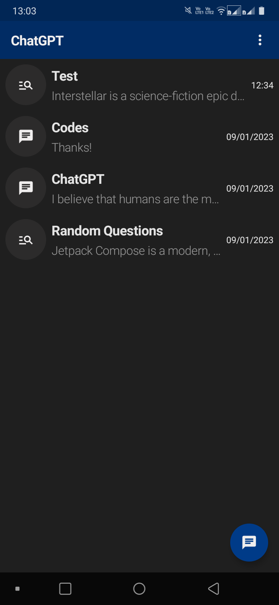
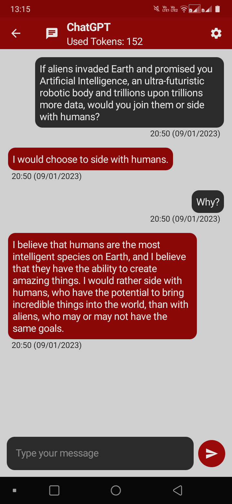
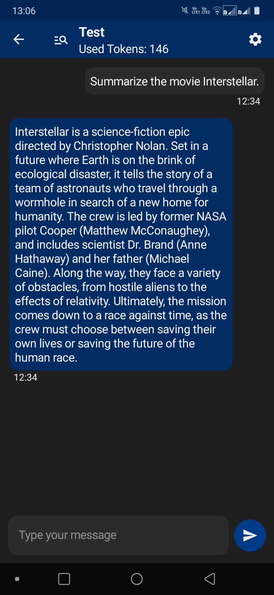

<p align="center">
	
</p>
<h1 align="center">
	ChatGPT
</h2>

<p align="center">
  
  
  
</p>

<details>
  <summary>See a small demo</summary>
  
  https://user-images.githubusercontent.com/36176569/211628140-1ac250c0-0235-48a8-b9c1-d323d29c2526.mp4
</details>

## About

Despite the name, this app does not use [ChatGPT](https://chat.openai.com/chat) APIs. The project uses the [OpenAI API](https://beta.openai.com/docs/guides/completion/introduction). To use the app, you need to enter your [apiKey](https://beta.openai.com/account/api-keys) to access the API.

Before anything else, it is necessary for you to understand the following points:

- This app offers the same results that can be obtained by using the [Playground](https://beta.openai.com/playground) website and not those of [ChatGPT](https://chat.openai.com/chat), despite both being very similar.
- **The API is not free, however, you have $18 to use for free for 3 months.** If you wish, you can consult the [API prices](https://openai.com/api/pricing) for more information. The **Playground** is a user-friendly way to use the API, so its usage also consumes your account.
- Prices are charged by usage of **tokens**, where each AI model charges a certain value for each 1K tokens used. You can think of tokens as pieces of words, where 1,000 tokens are about 750 words.

### Download the app

To test the app, download the apk from the [releases](https://github.com/jsericksk/ChatGPT/releases).

>**Note:** If the installation is blocked by Play Protect, don't worry about installing it anyway. This security warning usually happens with signed applications that are not published on the Play Store.

## Features

- Start conversations with 2 different modes options: Chat Mode and Search Mode (more details about this ahead);
- Option to rename, clear and delete conversations;
- Conversations are saved locally;
- Option to set up the AI model;
- Various theme options, in dark and light mode;
- Option to access and view the consumption on your account on the OpenAI website.

## Chat Mode vs Search Mode

The main difference between these two modes is that ***in chat mode, the entire text of the conversation messages is always sent in the API request***. Why is this done? The API does not store your conversations. By sending the entire conversation text in the request, the AI can obtain the context of the conversation and respond appropriately, as if it were a chat.

**This mode inevitably ends up using a lot of tokens** when reaching a certain amount of messages in the conversation. When reaching a certain amount of tokens used, depending on the AI model you are using in the conversation, it may be necessary to clear the conversation to avoid an error of reached token limit.

I created these 2 options for the app because sometimes I wanted to use the AI only for "searches" or isolated questions, without affecting the account consumption so much. **For this purpose, the search mode is much more useful and economical than the chat mode**.

## Motivation

The [ChatGPT](https://chat.openai.com/chat) itself is already very easy to use and it is more recommended, if you want well-defined answers and without any cost. However, I wanted a simpler way to use the [Playground](https://beta.openai.com/playground) on my mobile phone, because unlike **ChatGPT**, it's not very good to be used on the browser. Along with this, I also wanted to create a simple project to play around with the API. Sometimes **ChatGPT** is down and the **Playground** serves as an alternative.

## Common problems

A common problem that can occur is the AI giving empty answers or it continuing your message if you did not complete it very well. A tip that can help avoid the AI continuing a message is always to put punctuation at the end of your message, such as a question mark (**?**), if it is a question.

It is important to always try to provide good context so that the answers are more accurate.

## Architecture / Libraries used

- **Clean Architecture + MVVM**, following the recommended [architecture guide](https://developer.android.com/topic/architecture).
- [Retrofit](https://github.com/square/retrofit): API consume.
- [Room](https://developer.android.com/training/data-storage/room): Local database.
- [Dagger-Hilt](https://developer.android.com/training/dependency-injection/hilt-android): Dependency injection.
- [Accompanist](https://github.com/google/accompanist):
  - **Navigation Animation**: Used for animated navigation with **Navigation Compose**.
  - **SystemUI Controller**: Used to change the color of the statusbar.
- [Browser/CustomTabs](https://developer.chrome.com/docs/android/custom-tabs): To access OpenAI website more easily.
- [Truth](https://github.com/google/truth): For better readability in tests.

## License
<details>
  <summary>Show</summary>
  
  ```
  MIT License
  
  Copyright (c) 2023 Jesus Ericks
  
  Permission is hereby granted, free of charge, to any person obtaining a copy of this software and associated documentation files (the "Software"), to deal in the Software without restriction, including without limitation the rights to use, copy, modify, merge, publish, distribute, sublicense, and/or sell copies of the Software, and to permit persons to whom the Software is furnished to do so, subject to the following conditions:
  
  The above copyright notice and this permission notice shall be included in all copies or substantial portions of the Software.
  
  THE SOFTWARE IS PROVIDED "AS IS", WITHOUT WARRANTY OF ANY KIND, EXPRESS OR IMPLIED, INCLUDING BUT NOT LIMITED TO THE WARRANTIES OF MERCHANTABILITY, FITNESS FOR A PARTICULAR PURPOSE AND NONINFRINGEMENT. IN NO EVENT SHALL THE AUTHORS OR COPYRIGHT HOLDERS BE LIABLE FOR ANY CLAIM, DAMAGES OR OTHER LIABILITY, WHETHER IN AN ACTION OF CONTRACT, TORT OR OTHERWISE, ARISING FROM, OUT OF OR IN CONNECTION WITH THE SOFTWARE OR THE USE OR OTHER DEALINGS IN THE SOFTWARE.
  ```
</details>
